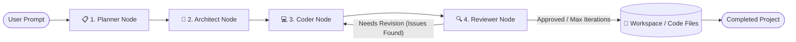

# 🤖 CodeGen Agent

<p align="center">
  <strong>Autonomous Multi-Agent Code Generation System with Review Loop</strong><br>
  Built with LangGraph, LangChain, FastAPI, and Groq (Llama 3.3 70B)
</p>

<p align="center">
  
  
  
  
  
  
</p>

---

## 📖 Overview

**CodeGen Agent** is a full-stack autonomous software generation engine inspired by platforms like Lovable and v0. Given a natural language description of what you want to build, the multi-agent system plans, architects, scaffolds, iteratively synthesizes, and reviews cohesive codebases with an automated feedback loop.

Unlike monolithic single-prompt LLM code generators that produce incomplete snippets or lose context in multi-file projects, **CodeGen Agent** employs an orchestrated multi-agent LangGraph pipeline with automated self-correction:
1. **Planner Agent** designs high-level application specs, tech stacks, feature lists, and file schemas.
2. **Architect Agent** breaks down the plan into ordered, granular, single-file implementation tasks.
3. **Coder Agent** iteratively synthesizes every file, feeding all previously generated files into context to ensure styles, IDs, and imports remain consistent.
4. **Reviewer Agent** inspects the generated code for syntax errors, missing functionality, broken references, or incomplete placeholders. If issues are identified, it sends actionable critique back to the Coder in a feedback loop until verified or iteration thresholds are reached.

---

## 🏛️ Architecture & Agent Pipeline

The core engine is structured as a compiled **LangGraph `StateGraph`** with a typed, centralized state model and conditional feedback loop:



### Agent Roles

| Agent Node | Responsibility | Output Artifact |
| :--- | :--- | :--- |
| **Planner** | Interprets user prompt; defines project name, description, features, tech stack, and file list. | `Plan` (Pydantic model) |
| **Architect** | Breaks down the plan into an execution sequence where each step targets a single file logically. | `TaskPlan` (Ordered implementation steps) |
| **Coder** | Scaffolds the workspace directory, writes code, and applies Reviewer fixes in revision loops. | Generated files in `workspace/<slug>/` |
| **Reviewer** | Audits generated codebase for syntax, feature completeness, and cross-file cohesion. | `ReviewFeedback` (Approve/Reject + issue instructions) |

---

## 🔁 Reviewer Feedback Loop

The Reviewer agent acts as an autonomous QA engineer:
- **Completeness Check**: Verifies that every requested feature from the user prompt and specification is fully implemented.
- **Cross-File Cohesion**: Ensures HTML IDs match JS DOM selectors, CSS classes are applied consistently, and file imports resolve correctly.
- **No Incomplete Stubs**: Flags empty TODO comments, mock placeholders, or unhandled events.
- **Automated Re-prompting**: If issues are found, the Reviewer generates targeted `FileIssue` items with exact `fix_instruction` notes. The graph dynamically cycles back to the Coder node to patch the files before re-evaluating.

---

## 📂 Project Structure

The codebase is organized into modular packages adhering to production software engineering standards:

```text
codegen-agent/
├── agent/                         # Multi-Agent Core Engine
│   ├── __init__.py                # Package exports & public API
│   ├── graph.py                   # LangGraph workflow with Reviewer feedback loop
│   │
│   ├── core/                      # Core models & LLM configurations
│   │   ├── __init__.py
│   │   ├── llm.py                 # ChatGroq Llama 3.3 70B LLM initialization
│   │   └── state.py               # Pydantic states (GraphState, Plan, File, TaskPlan, ReviewFeedback)
│   │
│   ├── nodes/                     # Discrete Agent Nodes
│   │   ├── __init__.py
│   │   ├── planner.py             # Planner agent node
│   │   ├── architect.py           # Architect agent node
│   │   ├── coder.py               # Coder agent node (with fix revision support)
│   │   └── reviewer.py            # Reviewer QA agent node
│   │
│   ├── prompts/                   # Prompt Templates
│   │   ├── __init__.py
│   │   ├── planner.py             # Planning prompt template
│   │   ├── architect.py           # Task decomposition prompt template
│   │   ├── coder.py               # Code generation & fix prompts
│   │   └── reviewer.py            # Code review & quality check prompt template
│   │
│   └── tools/                     # Workspace & Utility Tools
│       ├── __init__.py
│       └── filesystem.py          # File I/O, slugification, context builder
│
├── api/                           # API Layer
│   ├── __init__.py
│   └── router.py                  # Endpoints (/health, /generate)
│
├── config/                        # Settings & Environment Configuration
│   └── settings.py                # Pydantic BaseSettings & CORS configuration
│
├── workspace/                     # Output directory for generated applications
│
├── main.py                        # FastAPI application entrypoint
├── pyproject.toml                 # Project metadata & dependencies
└── uv.lock                        # Lockfile for reproducible installs
```

---

## 🚀 Getting Started

### 1. Prerequisites

- **Python**: Version `3.11` or higher
- **Groq API Key**: Get a free API key from [Groq Console](https://console.groq.com)
- **Package Manager**: [uv](https://github.com/astral-sh/uv) (recommended) or `pip`

### 2. Installation

Clone the repository and install dependencies:

```bash
git clone https://github.com/SONAWANE-SUSHANT/LOVABLE_CLONE.git
cd LOVABLE_CLONE

# Using uv (fastest)
uv sync

# Or using pip / venv
python -m venv .venv
# Windows:
.venv\Scripts\activate
# Linux/macOS:
source .venv/bin/activate
pip install -e .
```

### 3. Environment Setup

Create a `.env` file in the root directory:

```env
GROQ_API_KEY=your_groq_api_key_here
APP_ENV=development
```

---

## 💻 Usage

### Option A: Run via Python CLI / Script

You can invoke the compiled agent graph directly in Python:

```python
from agent.graph import graph
from agent.core.state import GraphState

# Define your project prompt
initial_state = GraphState(
    user_prompt="Build a modern Kanban board with drag and drop cards, task categories, and local storage persistence."
)

# Run the multi-agent pipeline (Planner -> Architect -> Coder <-> Reviewer)
result = graph.invoke(initial_state)

print(f"Status: {result.status}")
print(f"Project created at: {result.project_root}")
print(f"Files generated: {result.completed_files}")
if result.review_feedback:
    print(f"Review approved: {result.review_feedback.is_approved}")
    print(f"Review summary: {result.review_feedback.summary}")
```

### Option B: Run as a FastAPI Service

Launch the development server:

```bash
uv run uvicorn main:app --reload --port 8000
```

Once running, interactive documentation is available at:
- **Swagger UI**: [http://localhost:8000/docs](http://localhost:8000/docs)
- **ReDoc**: [http://localhost:8000/redoc](http://localhost:8000/redoc)

#### Trigger Code Generation via REST API:

```bash
curl -X POST "http://localhost:8000/generate" \
  -H "Content-Type: application/json" \
  -d '{
    "prompt": "Create a modern responsive landing page for an AI developer platform with dark mode and pricing cards."
  }'
```

**Example JSON Response:**
```json
{
  "status": "completed",
  "project_name": "ai-developer-platform",
  "project_root": "workspace/ai-developer-platform",
  "completed_files": [
    "index.html",
    "styles.css",
    "script.js"
  ],
  "review_approved": true,
  "review_summary": "All features implemented cleanly, responsive CSS verified, and event listeners configured properly.",
  "iteration_count": 0
}
```

---

## ⚙️ Configuration

| Variable | Description | Default |
| :--- | :--- | :--- |
| `GROQ_API_KEY` | API key for Groq inference (Llama 3.3 70B) | Required |
| `APP_ENV` | Application environment (`development` / `production`) | `development` |
| `EXPRESS_API_BASE_URL` | Optional Express API gateway URL for production CORS | `None` |
| `GEMINI_API_KEY` | Optional Gemini API key if using multimodal / auxiliary models | `None` |
| `QDRANT_URL` | Optional Qdrant vector database URL for embeddings | `None` |

---

## 🛠️ Tech Stack

- **Orchestration**: [LangGraph](https://github.com/langchain-ai/langgraph)
- **LLM Framework**: [LangChain Groq](https://github.com/langchain-ai/langchain)
- **Model**: `llama-3.3-70b-versatile` via Groq Cloud
- **API Framework**: [FastAPI](https://fastapi.tiangolo.com/) + [Uvicorn](https://www.uvicorn.org/)
- **Validation**: [Pydantic v2](https://docs.pydantic.dev/) + [Pydantic Settings](https://docs.pydantic.dev/latest/concepts/pydantic_settings/)
- **Package Management**: [uv](https://astral.sh/uv)

---

## 📄 License

This project is licensed under the MIT License.
